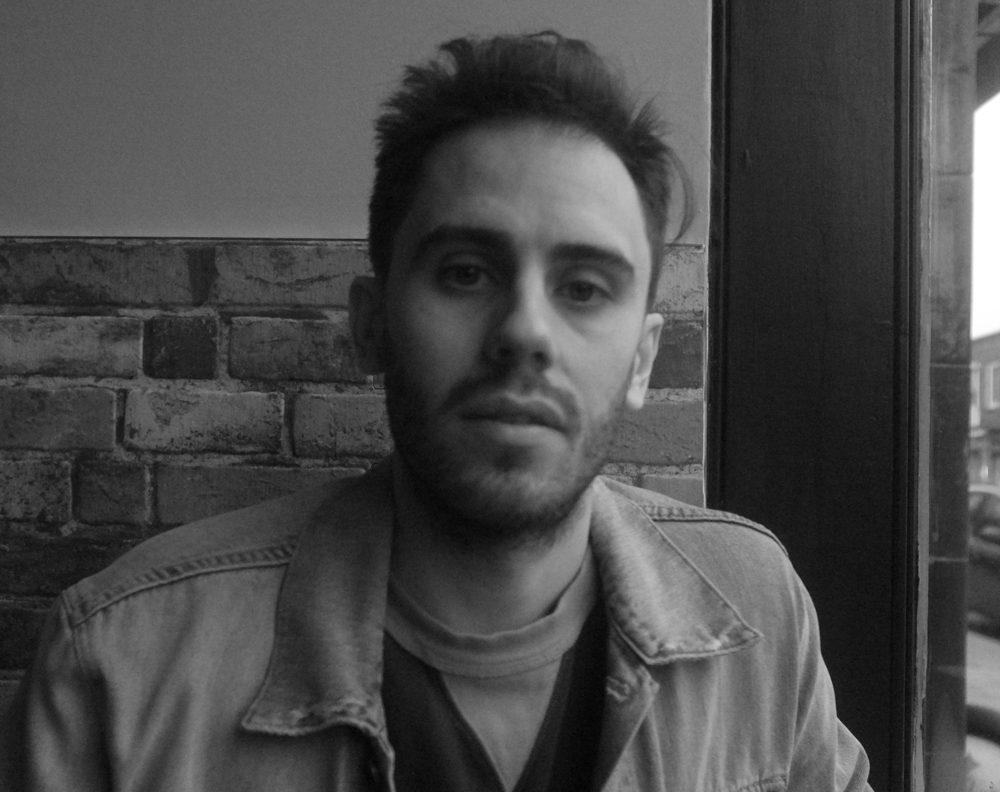

## Professional 

I'm a cryptographer, with a focus on practical implementations and cryptanalysis. 
You can find a link to my publications on [Google Scholar](https://scholar.google.co.uk/citations?user=LItUNn4AAAAJ&hl=en).

Since November 2017 I have been employed at the University of Bristol in the [SCA / Crypto group](http://www.bristol-sca.com). Past research positions and education history can be found on my [CV](files/CV.pdf).

## Research Interests

The focus of my research is mainly based around post-quantum cryptography, specifically lattice-based cryptography, and investigating them with respect to optimised hardware designs, optimised software designs, and side-channel attacks and countermeasures.

